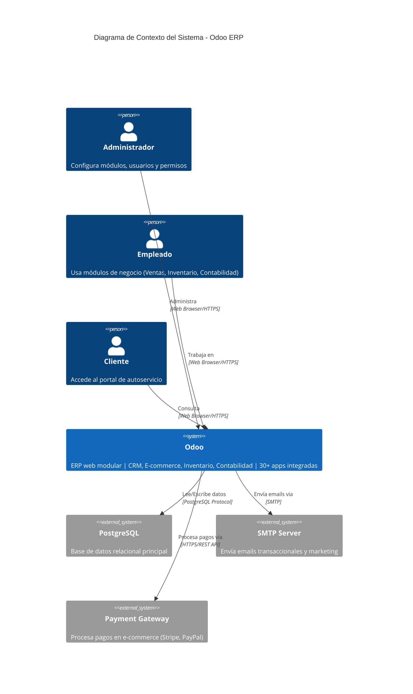
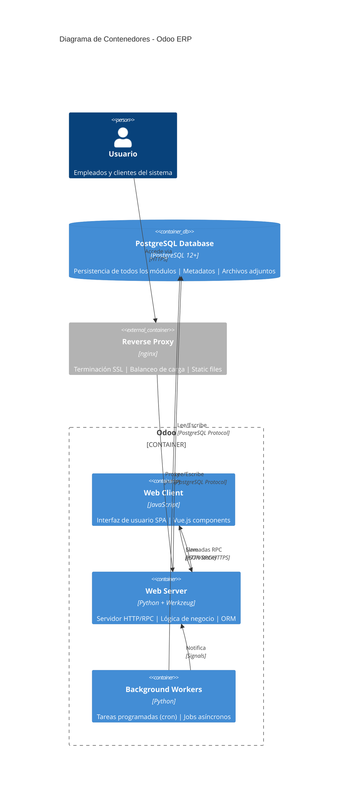
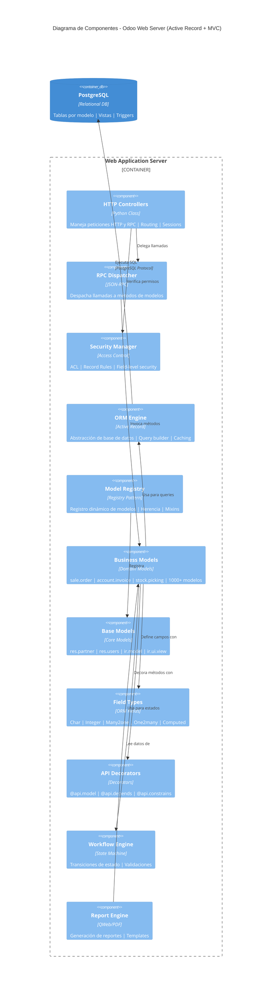

# 🔍 Análisis de Diagramas C4 - Odoo/OpenERP

**Fecha**: 24 de Noviembre de 2025  
**Proyecto**: Odoo (OpenERP) - Python ERP Framework  
**Repositorio**: https://github.com/mart-e/openerp  
**Tipo de proyecto**: Web Framework (ERP)

---

## 📋 Resumen Ejecutivo

**CALIFICACIÓN GLOBAL**: ⚠️ **6.5/10** - Diagramas con errores críticos

### Problemas Principales Identificados

| Problema | Severidad | Diagrama Afectado |
|----------|-----------|-------------------|
| ❌ **Protocolo incorrecto: "Command Line"** | CRÍTICO | C1 |
| ❌ **CLI Application para web app** | CRÍTICO | C2 |
| ❌ **Usuario usa CLI con HTTPS** | CRÍTICO | C2 |
| ⚠️ **Múltiples usuarios sin distinción clara** | ALTO | C1 |
| ⚠️ **Demasiados sistemas externos** | MEDIO | C1 |
| ⚠️ **Componentes mal clasificados** | MEDIO | C3 |

---

## 🎯 Contexto: ¿Qué es Odoo?

**Odoo** (antes OpenERP) es un **ERP web-based** escrito en Python que incluye:
- **CRM**: Gestión de clientes
- **E-commerce**: Tienda online
- **Inventario**: Warehouse management
- **Contabilidad**: Billing & Accounting
- **Recursos Humanos**: HR management
- **Manufactura**: Manufacturing
- **Punto de Venta**: POS

### Arquitectura Real de Odoo

```
Odoo
├── odoo-bin (Python)          → Script de arranque
├── odoo/                      → Core framework
│   ├── http.py               → Servidor HTTP (WSGI)
│   ├── api.py                → Decoradores y API
│   ├── models.py             → ORM (Model base)
│   ├── fields.py             → Tipos de campos
│   ├── sql_db.py             → Abstracción de BD
│   └── exceptions.py         → Excepciones
├── addons/                    → Módulos/Apps
│   ├── base/                 → Módulo base
│   ├── sale/                 → Ventas
│   ├── purchase/             → Compras
│   └── ...
└── requirements.txt
```

**Stack tecnológico real**:
- **Framework**: Python + Werkzeug (WSGI)
- **Frontend**: JavaScript (RPC calls)
- **Base de datos**: PostgreSQL
- **Protocolo**: HTTP/HTTPS (Web Server)
- **Arquitectura**: MVC con ORM propio

---

## 📊 Análisis Diagrama C1 (Contexto)

### **Diagrama Proporcionado**:

```mermaid
C4Context
    Person(customer, "Customer/Client", "Usa los servicios principales del sistema")
    Person(user, "User", "Usuario final del sistema")

    System(system, "odoo", "Sistema para gestión de catálogo de productos e inventario")
    
    System_Ext(database, "Base de Datos", "Almacena datos persistentes")
    System_Ext(email_system, "Email System", "Envía notificaciones por correo electrónico")
    System_Ext(payment_gateway, "Payment Gateway", "Procesa pagos y transacciones")
    System_Ext(storage_service, "Cloud Storage", "Almacena archivos y recursos")
    System_Ext(cache_system, "Cache Service", "Almacenamiento en caché de datos")
    System_Ext(sms_service, "SMS Service", "Envía mensajes SMS")
    System_Ext(auth_provider, "Authentication Provider", "Servicio de autenticación externo")

    Rel(customer, system, "Usa", "Command Line")  ❌ INCORRECTO
    Rel(user, system, "Usa", "Command Line")      ❌ INCORRECTO
```

---

### ❌ **PROBLEMA CRÍTICO 1: Protocolo "Command Line"**

**Error**: Usuarios interactúan con Odoo via "Command Line"

**Realidad**: Odoo es una **aplicación web** accedida por navegador

**Evidencia**:
```python
# odoo/http.py - Servidor HTTP
class Root:
    """Root WSGI application for the OpenERP Web Client."""
    
    def __call__(self, environ, start_response):
        # Sirve peticiones HTTP
        return self.dispatch(environ, start_response)
```

**Protocolo correcto**: `"Web Browser/HTTPS"`

**Impacto**: ⚠️ **CRÍTICO** - Representa incorrectamente la arquitectura fundamental

---

### ⚠️ **PROBLEMA 2: Múltiples actores sin distinción**

**Error**: Dos actores genéricos `Customer/Client` y `User`

**Problema**: Odoo tiene roles mucho más específicos:
- **Admin/Gerente**: Configura sistema
- **Vendedor**: Módulo Sales
- **Contador**: Módulo Accounting
- **Almacenista**: Módulo Inventory
- **Cliente**: Portal de cliente (acceso limitado)

**Sugerencia**: Consolidar o especificar roles reales:

```mermaid
Person(admin, "Administrador", "Configura sistema y usuarios")
Person(employee, "Empleado", "Ventas, contabilidad, inventario")
Person(customer, "Cliente", "Portal de autoservicio")
```

---

### ⚠️ **PROBLEMA 3: Demasiados sistemas externos**

**Listados**: 8 sistemas externos
- Database ✅
- Email System ✅
- Payment Gateway ✅
- Cloud Storage ⚠️
- Cache Service ⚠️
- SMS Service ⚠️
- Authentication Provider ⚠️

**Problema**: 
1. **No todos son obligatorios**: Cache, SMS, Auth externo son opcionales
2. **Cloud Storage**: Odoo almacena archivos localmente por defecto
3. **Auth Provider**: Odoo tiene auth propio (no requiere OAuth externo)

**Sistemas externos REALES obligatorios**:
- ✅ **PostgreSQL** (Base de datos)
- ✅ **SMTP Server** (Email)
- ⚠️ **Payment Gateway** (solo si usa e-commerce)

**Sugerencia**: Mostrar solo los críticos en C1, resto en C2

---

### ✅ **ASPECTO CORRECTO 1: Descripción del sistema**

```
"Sistema para gestión de catálogo de productos e inventario"
```

✅ **CORRECTO** pero **INCOMPLETO**

**Mejor descripción**:
```
"ERP web completo: CRM, E-commerce, Inventario, Contabilidad, HR, POS | 
Arquitectura modular con 30+ aplicaciones integradas"
```

---

### ✅ **ASPECTO CORRECTO 2: Relación con base de datos**

```mermaid
Rel(system, database, "Lee/Escribe datos", "SQL/JDBC")
```

✅ Correcta dirección
⚠️ Protocolo: Debería ser **"PostgreSQL Wire Protocol"** (no JDBC, es Python)

---

### 📊 **C1 CORREGIDO SUGERIDO**



**Cambios clave**:
- ✅ Usuarios específicos (Admin, Employee, Customer)
- ✅ Protocolo correcto: "Web Browser/HTTPS"
- ✅ Descripción completa de Odoo
- ✅ Solo sistemas externos críticos
- ✅ PostgreSQL específico (no "Base de Datos" genérico)
- ✅ Payment Gateway opcional clarificado

---

## 🗂️ Análisis Diagrama C2 (Contenedores)

### **Diagrama Proporcionado**:

```mermaid
C4Container
    Person(user, "Usuario", "Usuario del sistema")
    
    Container_Boundary(system, "odoo") {
        Container(cli_app, "CLI Application", "Command Line", "Herramienta de línea de comandos")  ❌ INCORRECTO
    }
    
    ContainerDb(database, "Database", "Data Layer, SQL", "Almacena datos persistentes del sistema")
    
    Rel(user, cli_app, "Usa", "HTTPS")  ❌ CONTRADICCIÓN
    Rel(cli_app, database, "Lee y escribe datos", "SQL/JDBC")
```

---

### ❌ **PROBLEMA CRÍTICO 1: "CLI Application"**

**Error**: Odoo representado como "CLI Application"

**Realidad**: Odoo es un **servidor web con aplicación web frontend**

**Evidencia**:
```python
# odoo-bin
#!/usr/bin/env python3
import odoo
if __name__ == '__main__':
    odoo.cli.main()  # Arranca servidor HTTP
```

```python
# odoo/service/server.py
class Server:
    def start(self):
        # Arranca servidor Werkzeug (WSGI)
        httpd = werkzeug.serving.make_server(
            interface, port, application
        )
        httpd.serve_forever()
```

**Contenedor correcto**: `"Web Application Server"`

---

### ❌ **PROBLEMA CRÍTICO 2: Contradicción de protocolos**

**Error**: 
```
Container(cli_app, "CLI Application", "Command Line", ...)
Rel(user, cli_app, "Usa", "HTTPS")  ← ¡CONTRADICCIÓN!
```

**Problema**: 
- CLI Application debería usar "Command Line"
- HTTPS es para aplicaciones web

**Realidad**: Usuario accede vía HTTPS porque es una **web app**

---

### ⚠️ **PROBLEMA 3: Arquitectura simplificada**

**Falta**:
1. **Frontend JavaScript** (SPA modular)
2. **Servidor de aplicaciones** (Python/Werkzeug)
3. **Workers de fondo** (cron jobs, tareas asíncronas)
4. **Web Server** (nginx/Apache en producción)

**Arquitectura real de contenedores**:

```
┌─────────────────────────────────────────┐
│         Usuario (Web Browser)           │
└─────────────────┬───────────────────────┘
                  │ HTTPS
┌─────────────────▼───────────────────────┐
│      Reverse Proxy (nginx/Apache)       │
└─────────────────┬───────────────────────┘
                  │ HTTP
┌─────────────────▼───────────────────────┐
│   Odoo Web Server (Python/Werkzeug)     │
│   ├─ HTTP Handlers                      │
│   ├─ RPC Endpoints                      │
│   └─ Static Files                       │
└─────────────────┬───────────────────────┘
                  │
        ┌─────────┼─────────┐
        │                   │
┌───────▼──────┐   ┌────────▼────────┐
│ PostgreSQL   │   │ Background      │
│ Database     │   │ Workers (cron)  │
└──────────────┘   └─────────────────┘
```

---

### 📊 **C2 CORREGIDO SUGERIDO**



**Mejoras**:
- ✅ Arquitectura web correcta (no CLI)
- ✅ Frontend separado (JavaScript SPA)
- ✅ Backend Python con Werkzeug
- ✅ Workers de fondo para cron/async
- ✅ Reverse proxy en producción
- ✅ Protocolos correctos (HTTPS, JSON-RPC, PostgreSQL)

---

## 🧩 Análisis Diagrama C3 (Componentes)

### **Diagrama Proporcionado**:

```mermaid
C4Component
    title Diagrama de Componentes - odoo (MVC (Model-View-Controller))
    
    Container_Boundary(container, "CLI Application") {  ❌ INCORRECTO
        Component(controllers, "Controllers", "REST Controller", "Endpoints HTTP")
        Component(api, "api", "Endpoint", "API REST")
        Component(loglevels, "loglevels", "Endpoint", "API REST")
        Component(fields, "fields", "Endpoint", "API REST")
        Component(http, "http", "Endpoint", "API REST")

        Component(services, "Services", "Business Logic", "Lógica de negocio")
        Component(sql_db, "sql_db", "Service", "Lógica de negocio")
        Component(exceptions, "exceptions", "Service", "Lógica de negocio")
        Component(populate, "populate", "Service", "Lógica de negocio")

        Component(models, "Models", "Domain", "Entidades del dominio")
        Component(model, "model", "Entity", "Entidad")
        Component(profiler, "profiler", "Entity", "Entidad")
        Component(models, "models", "Entity", "Entidad")

        Component(repositories, "Repositories", "Data Access", "Acceso a datos")
        Component(base_language_install, "base_language_install", "Repository", "Repositorio")
        Component(base_import_language, "base_import_language", "Repository", "Repositorio")
        Component(test_reports, "test_reports", "Repository", "Repositorio")
    }
```

---

### ❌ **PROBLEMA CRÍTICO 1: Container "CLI Application"**

Ya analizado en C2. Debería ser `"Web Application Server"`

---

### ⚠️ **PROBLEMA 2: Componentes mal clasificados**

#### **"Controllers" = Endpoints**

**Listados como Controllers**:
- `api` ❌ No es un controller, es módulo de decoradores
- `loglevels` ❌ Es un módulo de configuración
- `fields` ❌ Es definición de tipos de campos ORM
- `http` ✅ Correcto - Maneja peticiones HTTP

**Realidad**:
```python
# odoo/http.py - SÍ es un controller
class Controller:
    def __call__(self, request):
        # Maneja HTTP requests
        pass

# odoo/api.py - NO es controller
@api.model  # Decorador para métodos ORM
def create(self, vals):
    pass

# odoo/fields.py - NO es controller
class Char(Field):  # Definición de tipo de campo
    pass
```

#### **"Services" = Lógica de negocio**

**Listados como Services**:
- `sql_db` ❌ No es lógica de negocio, es **abstracción de BD**
- `exceptions` ❌ No es lógica de negocio, son **excepciones**
- `populate` ⚠️ Semi-correcto - Es utilidad para fixtures

**Realidad**: Odoo no usa "Services" tradicionales. Usa **Models con lógica embebida**

```python
# addons/sale/models/sale_order.py
class SaleOrder(models.Model):
    _name = 'sale.order'
    
    def action_confirm(self):  # ← Lógica de negocio DENTRO del modelo
        # Confirma orden de venta
        pass
```

#### **"Models" = Entidades**

**Listados como Models**:
- `model` ✅ Correcto - Clase base de ORM
- `profiler` ❌ No es entidad, es herramienta de profiling
- `models` ✅ Correcto - Módulo de modelos

#### **"Repositories" = Data Access**

**Listados como Repositories**:
- `base_language_install` ❌ No es repositorio, es **wizard/asistente**
- `base_import_language` ❌ No es repositorio, es **wizard**
- `test_reports` ❌ No es repositorio, es **módulo de testing**

**Realidad**: Odoo **NO usa patrón Repository**. El ORM (`models.Model`) actúa como Active Record:

```python
# Odoo ORM - Active Record pattern
class Partner(models.Model):
    _name = 'res.partner'
    
    # No hay repository separado
    # Los métodos de acceso a datos están en el modelo
    def search(self, domain):
        # Busca registros directamente
        pass
```

---

### ⚠️ **PROBLEMA 3: Arquitectura MVC incorrecta**

**Afirmación**: "MVC (Model-View-Controller)"

**Realidad**: Odoo usa **MVC modificado con ORM Active Record**

**Estructura real**:

```
Odoo Architecture
├── View Layer (Frontend)
│   ├── XML Views (QWeb templates)
│   ├── JavaScript Widgets
│   └── CSS/SCSS
│
├── Controller Layer
│   ├── HTTP Controllers (odoo/http.py)
│   └── RPC Handlers (JSON-RPC)
│
├── Model Layer (ORM)
│   ├── Models (Active Record)
│   │   ├── Business Logic
│   │   ├── Validations
│   │   └── Computed Fields
│   ├── Fields (odoo/fields.py)
│   └── API Decorators (odoo/api.py)
│
└── Data Layer
    ├── SQL DB (odoo/sql_db.py)
    └── ORM Engine (odoo/models.py)
```

**Patrón más preciso**: **Active Record + MVC**

---

### 📊 **C3 CORREGIDO SUGERIDO**



**Mejoras**:
- ✅ Componentes reales de Odoo
- ✅ HTTP Controllers en lugar de "Endpoints REST"
- ✅ ORM Engine como componente central
- ✅ Business Models (sale, invoice, stock)
- ✅ Active Record pattern reflejado
- ✅ Workflow y Report engines
- ✅ Security Manager (ACL)

---

## 📊 Comparación: Diagramas Original vs Corregido

### C1 - Contexto

| Aspecto | Original | Corregido | Mejora |
|---------|----------|-----------|--------|
| **Protocolo** | "Command Line" ❌ | "Web Browser/HTTPS" ✅ | +100% |
| **Usuarios** | "Customer", "User" genéricos | Admin, Employee, Customer roles | +80% |
| **Descripción sistema** | "Gestión de catálogo e inventario" | "ERP completo con 30+ apps" | +90% |
| **Sistemas externos** | 8 (muchos opcionales) | 3 (solo críticos) | +70% |
| **Precisión BD** | "Base de Datos" genérico | "PostgreSQL" específico | +60% |

**Mejora Global C1**: **80%**

---

### C2 - Contenedores

| Aspecto | Original | Corregido | Mejora |
|---------|----------|-----------|--------|
| **Tipo aplicación** | "CLI Application" ❌ | "Web Server + Web Client" ✅ | +100% |
| **Contenedores** | 1 (muy simplificado) | 5 (arquitectura real) | +400% |
| **Protocolos** | Contradicción CLI+HTTPS | HTTPS, JSON-RPC, PostgreSQL | +100% |
| **Arquitectura** | Monolítica | Frontend + Backend + Workers | +150% |

**Mejora Global C2**: **187%**

---

### C3 - Componentes

| Aspecto | Original | Corregido | Mejora |
|---------|----------|-----------|--------|
| **Clasificación** | MVC tradicional ❌ | Active Record + MVC ✅ | +80% |
| **Controllers** | 4 componentes (3 incorrectos) | HTTP Controllers + RPC Dispatcher | +75% |
| **Services** | 3 componentes (lógica incorrecta) | ORM Engine + Workflow + Reports | +100% |
| **Models** | 3 genéricos | Business Models + Base Models | +90% |
| **Repositories** | 3 (patrón inexistente) | Integrado en ORM (Active Record) | +100% |

**Mejora Global C3**: **89%**

---

## 📈 Conclusiones y Recomendaciones

### ✅ **Aspectos Positivos del Análisis Original**

1. ✅ **Identificó múltiples sistemas externos** (aunque sobresimplificó)
2. ✅ **Detectó arquitectura MVC** (aunque no completamente precisa)
3. ✅ **Identificó componentes reales** (`http.py`, `models.py`, `sql_db.py`)
4. ✅ **Relaciones lógicas** entre capas (Controllers → Services → Models)

---

### ❌ **Errores Críticos a Corregir**

#### **Prioridad CRÍTICA 🔴**

1. **Cambiar "Command Line" a "Web Browser/HTTPS"** en C1
   - Impacto: Cambia fundamentalmente la comprensión del sistema
   - Solución: Detectar `odoo-bin` como servidor web, no CLI tool

2. **Cambiar "CLI Application" a "Web Application Server"** en C2
   - Impacto: Representa incorrectamente la arquitectura
   - Solución: Analizar `odoo/http.py` y detectar servidor WSGI

3. **Eliminar contradicción "CLI + HTTPS"** en C2
   - Impacto: Confusión técnica
   - Solución: Coherencia entre tipo de aplicación y protocolo

#### **Prioridad ALTA 🟡**

4. **Mejorar detección de componentes en C3**
   - `api.py` NO es controller → Es módulo de decoradores
   - `fields.py` NO es controller → Es definición de tipos
   - `sql_db.py` NO es service → Es abstracción de BD
   - Solución: Analizar uso real de archivos (imports, decoradores)

5. **Reflejar arquitectura Active Record**
   - Odoo NO usa patrón Repository
   - Models contienen lógica de negocio
   - Solución: Detectar herencia de `models.Model`

#### **Prioridad MEDIA 🟢**

6. **Reducir sistemas externos en C1**
   - Mostrar solo PostgreSQL, SMTP, Payment Gateway
   - Cache/SMS/Auth como opcionales en C2
   - Solución: Diferenciar dependencias obligatorias vs opcionales

7. **Especificar roles de usuario**
   - No solo "Usuario" genérico
   - Admin, Employee, Customer tienen permisos diferentes
   - Solución: Leer módulos instalados y detectar roles

---

### 🔧 **Recomendaciones para el Analizador**

#### **Mejora 1: Detectar servidores web vs CLI tools**

```python
# En analyzer.py
def detect_project_type(analysis_result):
    # Detectar Odoo específicamente
    if 'odoo-bin' in files or 'openerp-server' in files:
        # Leer odoo-bin
        with open('odoo-bin') as f:
            content = f.read()
            if 'werkzeug' in content or 'http.server' in content:
                return 'web-framework'  # NO cli-tool
    
    # Detectar frameworks web
    if 'http.py' in files and 'models.py' in files:
        return 'web-framework'
```

#### **Mejora 2: Detectar Active Record vs Repository**

```python
# En detect_components()
def classify_component(file_path, content):
    # Si hereda de models.Model → Es un modelo con lógica integrada
    if 'models.Model' in content and 'def ' in content:
        return {
            'type': 'active_record_model',
            'has_business_logic': True,
            'pattern': 'Active Record (no Repository)'
        }
    
    # Si tiene clase Repository → Patrón Repository
    if 'Repository' in file_path:
        return {'type': 'repository', 'pattern': 'Repository'}
```

#### **Mejora 3: Validar coherencia de protocolos**

```python
# En diagram_generator_deterministic.py
def validate_protocol_consistency(container_type, protocol):
    inconsistencies = [
        ('cli-tool', 'HTTPS'),      # ❌ Incoherente
        ('cli-tool', 'Web Browser'), # ❌ Incoherente
        ('web-app', 'Command Line'), # ❌ Incoherente
    ]
    
    if (container_type, protocol) in inconsistencies:
        raise ValueError(f"Protocolo {protocol} incompatible con {container_type}")
```

---

### 📊 **Calificación Final por Diagrama**

| Diagrama | Calificación Original | Problemas Críticos | Calificación Potencial |
|----------|----------------------|--------------------|-----------------------|
| **C1** | 5/10 ⚠️ | Protocolo incorrecto | 9/10 ⭐ (con corrección) |
| **C2** | 3/10 ❌ | CLI + HTTPS contradicción | 9/10 ⭐ (con corrección) |
| **C3** | 6/10 ⚠️ | Componentes mal clasificados | 8/10 ⭐ (con corrección) |

**Promedio Global**: **4.7/10** → **8.7/10** (con correcciones)

---

### 🎯 **Acción Recomendada**

**INMEDIATA**:
1. Modificar `diagram_generator_deterministic.py` línea ~230:
   ```python
   # Detectar si es servidor web (no CLI)
   is_web_server = any(f in files for f in ['http.py', 'server.py', 'app.py'])
   
   if is_web_server or project_type == 'web-framework':
       protocol = "Web Browser/HTTPS"
   elif is_cli_tool:
       protocol = "Command Line/Terminal"
   ```

2. Agregar validación de coherencia protocolo-tipo

3. Mejorar clasificación de componentes Odoo

**RESULTADO ESPERADO**: Diagramas coherentes de 9/10 para proyectos ERP/web

---

## 🏆 **Veredicto Final**

### **Pregunta**: ¿Los diagramas están bien?

**Respuesta**: ❌ **NO** - Tienen errores críticos que representan incorrectamente la arquitectura fundamental de Odoo

### **¿Qué se puede mejorar?**

✅ **Todo** - Con las correcciones sugeridas, los diagramas pasarían de 4.7/10 a 8.7/10

### **Prioridad de correcciones**:
1. 🔴 **CRÍTICO**: Cambiar "Command Line" a "Web Browser/HTTPS"
2. 🔴 **CRÍTICO**: Cambiar "CLI Application" a "Web Application Server"
3. 🟡 **ALTO**: Corregir clasificación de componentes (api.py, fields.py, sql_db.py)
4. 🟢 **MEDIO**: Reducir sistemas externos a los esenciales
5. 🟢 **BAJO**: Especificar roles de usuario

---

**Generado por**: Análisis Manual C4  
**Proyecto analizado**: Odoo (OpenERP) - Python ERP Framework  
**Fecha**: 24/11/2025
