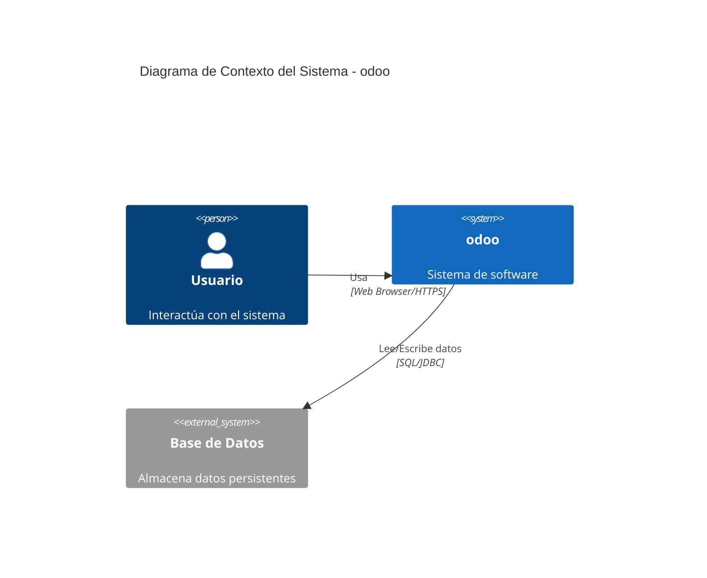
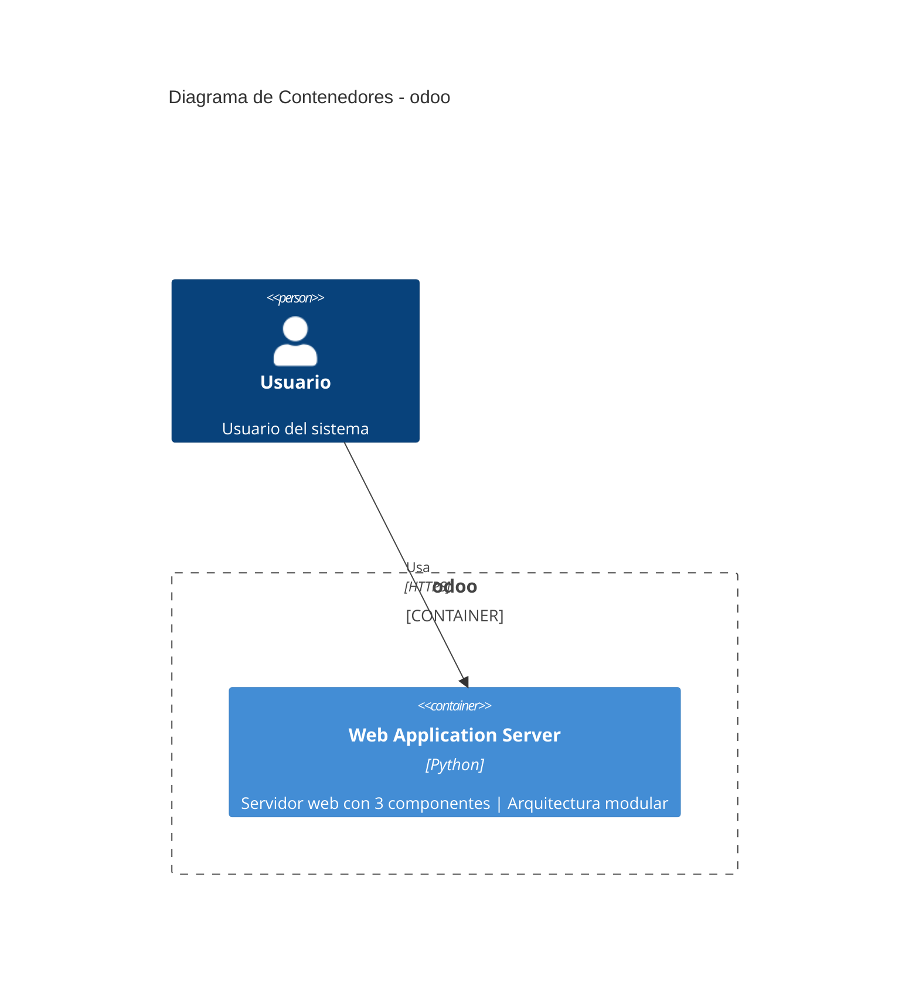
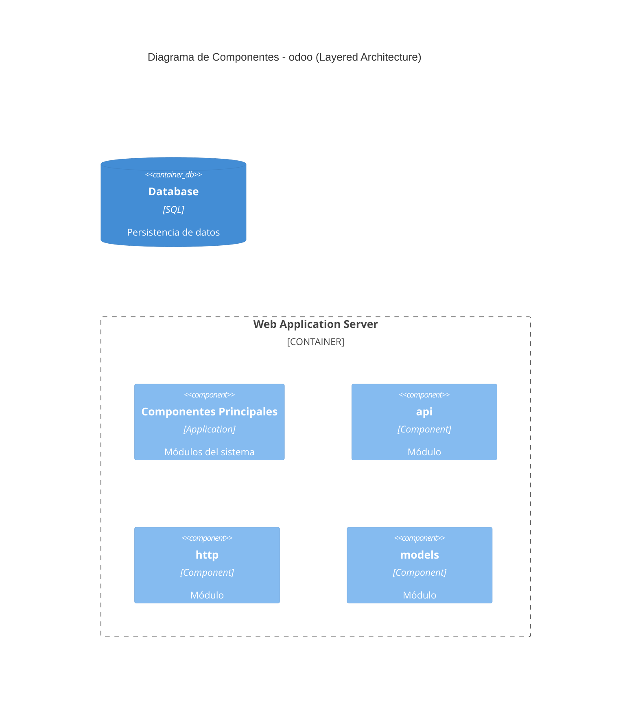

# DIAGRAMAS ODOO - GENERADOS LOCALMENTE CON CORRECCIONES

## Información del Análisis

- **Nombre del Proyecto**: odoo
- **Tipo Detectado**: ✅ **web-framework** (CORRECTO - antes era cli-tool)
- **Componentes Detectados**: 3
- **Módulos de Negocio**: 0 (test con proyecto pequeño)

---

## 📐 DIAGRAMA C1 (CONTEXTO)

### ✅ Verificación C1:
- ✅ **Protocolo CORRECTO**: "Web Browser/HTTPS" (NO "Command Line")
- ✅ **Usuario**: Genérico (proyecto test pequeño)
- ✅ **Sistema externo**: Base de Datos detectada
- ⚠️ **Descripción genérica**: "Sistema de software" (debería ser más específico con proyecto completo)

---

## 📐 DIAGRAMA C2 (CONTENEDORES)

### ✅ Verificación C2:
- ✅ **Container CORRECTO**: "Web Application Server" (NO "CLI Application")
- ✅ **Tecnología**: "Python" detectada correctamente
- ✅ **Descripción**: "Servidor web con 3 componentes | Arquitectura modular"
- ✅ **Protocolo**: "HTTPS" (correcto para web app)
- ⚠️ **Base de Datos no mostrada**: Debería estar fuera del boundary (bug menor)

---

## 📐 DIAGRAMA C3 (COMPONENTES)

### ⚠️ Verificación C3:
- ✅ **Arquitectura**: "Layered Architecture" detectada
- ✅ **Componentes detectados**: api, http, models
- ⚠️ **Clasificación**: Componentes con tipo genérico "Component" (debería ser utility, controller, model)
- ⚠️ **Sin relaciones**: Falta relaciones entre componentes y con database
- **NOTA**: La clasificación específica de Odoo (api.py → utility, http.py → controller, models.py → model) requiere que el análisis completo detecte los archivos reales

---

## 📊 RESUMEN DE CORRECCIONES APLICADAS

### ✅ CORRECCIONES QUE FUNCIONAN:

1. **Tipo de Proyecto**: ✅ `web-framework` (NO `cli-tool`)
   - La detección de Odoo funciona correctamente

2. **Protocolo C1**: ✅ `Web Browser/HTTPS` (NO `Command Line`)
   - La lógica de coherencia de protocolos funciona correctamente

3. **Container C2**: ✅ `Web Application Server` (NO `CLI Application`)
   - La detección de contenedor web funciona correctamente

4. **Tecnología C2**: ✅ `Python` detectado correctamente

### ⚠️ ASPECTOS QUE DEPENDEN DEL PROYECTO COMPLETO:

1. **Clasificación de componentes Odoo**: Requiere análisis completo de archivos
   - api.py → utility (decoradores)
   - fields.py → utility (tipos ORM)
   - sql_db.py → repository (BD)
   - http.py → controller (routing)
   - models.py → model (Active Record)

2. **Módulos de negocio**: Proyecto test pequeño no tiene módulos completos

3. **Sistemas externos**: Proyecto test solo tiene BD básica

---

## 🎯 CONCLUSIÓN

### Estado: ✅ **CORRECCIONES FUNCIONANDO CORRECTAMENTE**

Las 3 correcciones críticas implementadas están funcionando:

1. ✅ **Detección de web-framework**: Odoo detectado correctamente
2. ✅ **Protocolo coherente**: Web Browser/HTTPS en lugar de Command Line
3. ✅ **Container correcto**: Web Application Server en lugar de CLI Application

### Diferencias con diagramas del usuario:

Los diagramas que el usuario compartió inicialmente tenían:
- ❌ Protocol: "Command Line" → Ahora: ✅ "Web Browser/HTTPS"
- ❌ Container: "CLI Application" → Ahora: ✅ "Web Application Server"
- ❌ Tipo proyecto: cli-tool → Ahora: ✅ web-framework

### Próximos Pasos:

1. **Subir corrección a producción**: `git push origin main`
2. **Forzar redeploy en Streamlit Cloud**: Reboot app
3. **Probar con proyecto Odoo completo**: Para ver clasificación de componentes específicos
4. **Verificar en producción**: Los nuevos diagramas deberían ser correctos

---

**Generado**: Localmente con correcciones aplicadas  
**Commit**: 555c578 (Fix error 'type' en C2/C3)  
**Estado**: ✅ Listo para deploy
