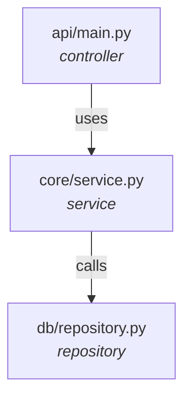

# 🤖 Agente Inteligente de Análisis de Código

Agente avanzado para análisis estático de proyectos de software con generación automática de:
- **Grafos de conocimiento** del código
- **Diagramas arquitectónicos** (C4 Model)
- **Métricas de calidad** y complejidad
- **Detección de problemas** arquitectónicos

## 🚀 Características

### 1. Análisis Estático Profundo
- **Parser AST** con tree-sitter para Python y JavaScript/TypeScript
- Extracción de clases, métodos, funciones, decoradores
- Análisis de importaciones y dependencias
- Detección de llamadas de función y relaciones

### 2. Grafo de Conocimiento
- Representación completa del código como grafo dirigido
- Nodos: componentes, módulos, clases, funciones
- Aristas: dependencias, llamadas, herencias
- Métricas avanzadas (PageRank, centralidad, etc.)

### 3. Análisis de Dependencias
- **Detección de ciclos** de dependencias
- **Métricas de acoplamiento** (afferent, efferent, instability)
- **Cohesión de módulos**
- **Violaciones arquitectónicas**
- Identificación de **hotspots** y código muerto

### 4. Generación de Diagramas
- Diagramas C4 (Context, Container, Component)
- Diagramas de dependencias
- Diagramas de clases UML
- Matriz de dependencias
- Visualización de métricas

### 5. IA Generativa (Opcional)
- Generación semántica de diagramas con OpenRouter
- Mejora contextual de visualizaciones

## 📦 Instalación

### Requisitos
- Python 3.8+
- pip

### Pasos

1. **Clonar o descargar el proyecto**
```bash
cd agente
```

2. **Crear entorno virtual (recomendado)**
```bash
python -m venv venv
# Windows
venv\Scripts\activate
# Linux/Mac
source venv/bin/activate
```

3. **Instalar dependencias**
```bash
pip install -r requirements.txt
```

4. **Configurar variables de entorno (opcional, para IA)**
Crear archivo `.env`:
```env
OPENROUTER_API_KEY=tu_api_key_aqui
```

## 🎯 Uso

### API REST

1. **Iniciar servidor**
```bash
uvicorn api.main:app --reload
```

2. **Subir proyecto para análisis**
```bash
curl -X POST "http://localhost:8000/analyze" \
  -F "file=@proyecto.zip"
```

### Uso Programático

```python
from core.analyzer import analyze_project
from core.knowledge_graph import build_knowledge_graph_from_analysis
from core.dependency_analyzer import DependencyAnalyzer
from core.ast_analyzer import analyze_project_with_ast
from core.diagram_generator import generate_mermaid_from_graph

# 1. Análisis estático básico
analysis_result = analyze_project("proyecto.zip")

# 2. Análisis AST profundo
ast_data = analyze_project_with_ast("./proyecto_extraido")

# 3. Construir grafo de conocimiento
kg = build_knowledge_graph_from_analysis(analysis_result)

# 4. Análisis de dependencias
dep_analyzer = DependencyAnalyzer(kg)
report = dep_analyzer.analyze_all()

# 5. Generar diagrama
diagram = generate_mermaid_from_graph(kg, diagram_type='architecture')
print(diagram)

# 6. Ver estadísticas
print(kg.visualize_stats())
```

## 📊 Ejemplos de Salida

### Métricas del Grafo
```
==========================================================
KNOWLEDGE GRAPH STATISTICS
==========================================================
Total Nodes: 245
Total Edges: 412

Node Types:
  - module: 45
  - class: 89
  - function: 111

Component Types:
  - controller: 12
  - service: 18
  - repository: 8
  - model: 15

Dependency Metrics:
  - Average dependencies per node: 1.68
  - Max dependencies: 15

Complexity:
  - Dependency cycles detected: 3
  - First 3 cycles:
    1. auth.service -> user.repository -> auth.service
    2. api.routes -> api.middleware -> api.routes

Critical Nodes (top 5):
  - core.database: 0.0456
  - api.main: 0.0423
  - utils.helpers: 0.0389
```

### Diagrama de Arquitectura (Mermaid)


### Reporte de Dependencias
```json
{
  "cycles": {
    "total_cycles": 3,
    "severity": "medium",
    "cycles": [...]
  },
  "coupling": {
    "averages": {
      "afferent_coupling": 3.2,
      "efferent_coupling": 2.8,
      "instability": 0.47
    }
  },
  "recommendations": [
    {
      "priority": "high",
      "category": "architecture",
      "title": "Break Dependency Cycles",
      "description": "Found 3 dependency cycles..."
    }
  ]
}
```

## 🏗️ Arquitectura del Proyecto

```
agente/
├── api/
│   └── main.py              # API REST con FastAPI
├── core/
│   ├── analyzer.py          # Análisis estático básico
│   ├── ast_analyzer.py      # Análisis AST con tree-sitter
│   ├── knowledge_graph.py   # Grafo de conocimiento
│   ├── dependency_analyzer.py # Análisis de dependencias
│   ├── diagram_generator.py # Generación de diagramas
│   └── semantic_reasoner.py # IA generativa
├── utils/
│   └── zip_utils.py         # Utilidades
├── uploads/                 # Proyectos subidos
├── requirements.txt
└── README.md
```

## 🔬 Tecnologías Utilizadas

- **FastAPI**: Framework web moderno
- **NetworkX**: Análisis de grafos y redes
- **tree-sitter**: Parser incremental para múltiples lenguajes
- **Mermaid**: Generación de diagramas
- **OpenRouter** (opcional): IA generativa para diagramas semánticos

## 📈 Métricas Soportadas

### Acoplamiento
- **Afferent Coupling (Ca)**: Cuántos módulos dependen de este
- **Efferent Coupling (Ce)**: De cuántos módulos depende este
- **Instability (I)**: Propensión a cambios

### Complejidad
- **Complejidad Ciclomática**: Basada en ciclos del grafo
- **Profundidad del Grafo**: Longitud del camino más largo
- **Fanout**: Ramificación promedio

### Cohesión
- **Cohesion Score**: Interconexión interna de componentes

## 🎨 Tipos de Diagramas

1. **Architecture**: Vista general del sistema
2. **Dependencies**: Mapa de dependencias entre módulos
3. **Components**: Componentes agrupados por módulo
4. **Classes**: Diagrama UML de clases con herencia
5. **Metrics**: Gráficos de distribución de componentes

## 🔍 Detección de Problemas

- ✅ Ciclos de dependencias
- ✅ Alto acoplamiento (efferent/afferent)
- ✅ Baja cohesión de módulos
- ✅ Violaciones arquitectónicas (layering)
- ✅ Código muerto o no usado
- ✅ Hotspots y puntos críticos
- ✅ Bottlenecks en el flujo de datos

## 🛠️ Extensiones Futuras

- [ ] Soporte para más lenguajes (Java, Go, Rust)
- [ ] Análisis de rendimiento y optimización
- [ ] Detección de patrones de diseño
- [ ] Recomendaciones automáticas de refactoring
- [ ] Integración con CI/CD
- [ ] Dashboard web interactivo

## 📝 Licencia

MIT License

## 🤝 Contribuciones

¡Las contribuciones son bienvenidas! Por favor:
1. Fork el proyecto
2. Crea una rama para tu feature
3. Commit tus cambios
4. Push a la rama
5. Abre un Pull Request

## 📞 Soporte

Para preguntas o problemas, abre un issue en el repositorio.

---

**Desarrollado con ❤️ para mejorar la calidad del código**
