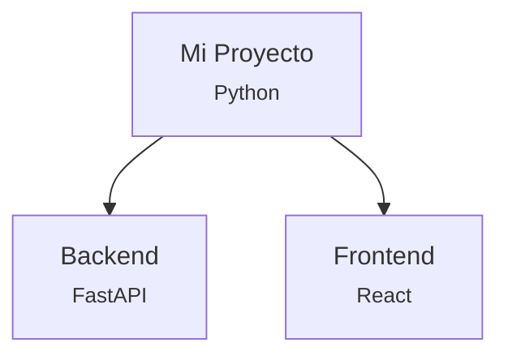
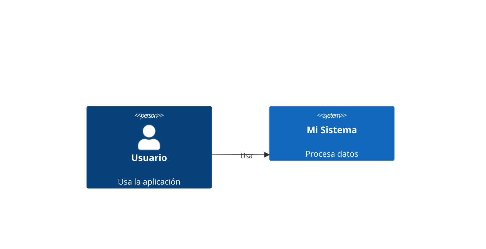

# ✅ Resumen: Tu Agente y Diagramas C4

## 🎯 Tu Objetivo
> "Quiero que el agente me dé el código Mermaid para visualizar en Mermaid Live el diagrama C4 de cualquier proyecto"

## ✅ RESPUESTA: Ya lo hace!

Tu agente **YA GENERA** código Mermaid para diagramas C4. Todos tus archivos originales siguen funcionando.

---

## 📦 Archivos Originales (TODOS funcionan)

| Archivo | Estado | Función |
|---------|--------|---------|
| `core/analyzer.py` | ✅ INTACTO | Análisis estático |
| `core/semantic_reasoner.py` | ✅ INTACTO | Genera C1/C2/C3 con IA |
| `core/diagram_generator.py` | ✅ FUNCIONAL | Genera C2 sin IA + nuevas funciones |
| `api/main.py` | ✅ COMPATIBLE | Endpoint `/analyze` sigue igual |

**Conclusión:** No perdiste nada, solo AGREGAMOS funcionalidades extra.

---

## 🚀 Cómo Obtener Diagramas C4

### Método 1: API REST (Recomendado)

```bash
# 1. Iniciar servidor
uvicorn api.main:app --reload

# 2. Subir proyecto
curl -X POST http://localhost:8000/analyze \
  -F "file=@mi-proyecto.zip" \
  -o resultado.json

# 3. El resultado.json contiene:
# - "mermaid_c2": Código Mermaid C2 estático
# - "semantic_c1": Código Mermaid C1 con IA
# - "semantic_c2": Código Mermaid C2 con IA
# - "semantic_c3": Código Mermaid C3 con IA
```

### Método 2: Script de Prueba

```bash
python test_c4.py
```

Este script:
1. Analiza un proyecto
2. Genera todos los diagramas C4
3. Los guarda en `output/c4_diagrams/*.mmd`
4. ¡Listos para copiar a https://mermaid.live!

### Método 3: Programático

```python
from core.analyzer import analyze_project, detect_actors
from core.semantic_reasoner import generate_semantic_mermaid_openrouter

# Analizar
analysis = analyze_project("proyecto.zip")
actors = detect_actors(analysis)

# Generar C4
c1 = generate_semantic_mermaid_openrouter(analysis, actors, "C1")
c2 = generate_semantic_mermaid_openrouter(analysis, actors, "C2")
c3 = generate_semantic_mermaid_openrouter(analysis, actors, "C3")

# Guardar
with open("c1.mmd", "w") as f:
    f.write(c1)
```

---

## 🎨 Tipos de Diagramas C4 Disponibles

### 1. C1 - Context (con IA)
```
Sistema + Actores + Sistemas Externos
└─ Muestra el panorama general
```

### 2. C2 - Container (estático o con IA)
```
Backend + Frontend + Database + Servicios
└─ Muestra contenedores del sistema
```

### 3. C3 - Component (con IA)
```
Controllers + Services + Repositories + Models
└─ Muestra componentes internos
```

---

## 🆕 Lo que AGREGAMOS (Bonus)

Además de lo que ya tenías, ahora también tienes:

- ✅ **Grafo de conocimiento** completo del proyecto
- ✅ **Análisis de dependencias** (ciclos, acoplamiento)
- ✅ **Métricas de calidad** (cohesión, complejidad)
- ✅ **6 tipos adicionales** de diagramas
- ✅ **Recomendaciones** automáticas de refactoring

Pero tu funcionalidad ORIGINAL de generar C4 **sigue igual de funcional**.

---

## ⚡ Prueba Rápida

```bash
# 1. Ejecutar test
python test_c4.py

# 2. Ver los archivos generados
cd output/c4_diagrams
dir  # Windows
ls   # Linux/Mac

# 3. Abrir cualquier .mmd
notepad c2_estatico.mmd  # Windows
cat c2_estatico.mmd      # Linux/Mac

# 4. Copiar el contenido
# 5. Ir a https://mermaid.live
# 6. Pegar
# 7. ¡Ver tu diagrama C4!
```

---

## 📋 Formato del Código Mermaid

### C2 Estático (lo que ya tenías):


### C4 con IA (lo que ya tenías):


---

## 🎯 Conclusión

### ✅ LO QUE YA FUNCIONA:
1. Subes un proyecto.zip
2. El agente lo analiza
3. Genera código Mermaid C4
4. Lo copias a https://mermaid.live
5. ¡Ves tu diagrama!

### ✅ LO QUE AGREGAMOS:
- Más tipos de análisis
- Más métricas
- Más diagramas
- Más recomendaciones

### ✅ LO QUE NO CAMBIÓ:
- Tu endpoint `/analyze` original
- Tus archivos core (analyzer, semantic_reasoner)
- La forma de generar C4

---

## 📞 Siguiente Paso

**Prueba ahora:**
```bash
python test_c4.py
```

O si tienes el servidor corriendo:
```bash
# Abre el navegador
http://localhost:8000/docs

# Usa el endpoint /analyze
# Sube un .zip
# Copia el código Mermaid del resultado
# Pégalo en mermaid.live
```

---

**TL;DR:** Tu agente YA hace lo que quieres. Los archivos originales siguen funcionando. Solo agregamos funcionalidades extra opcionales. 🚀
