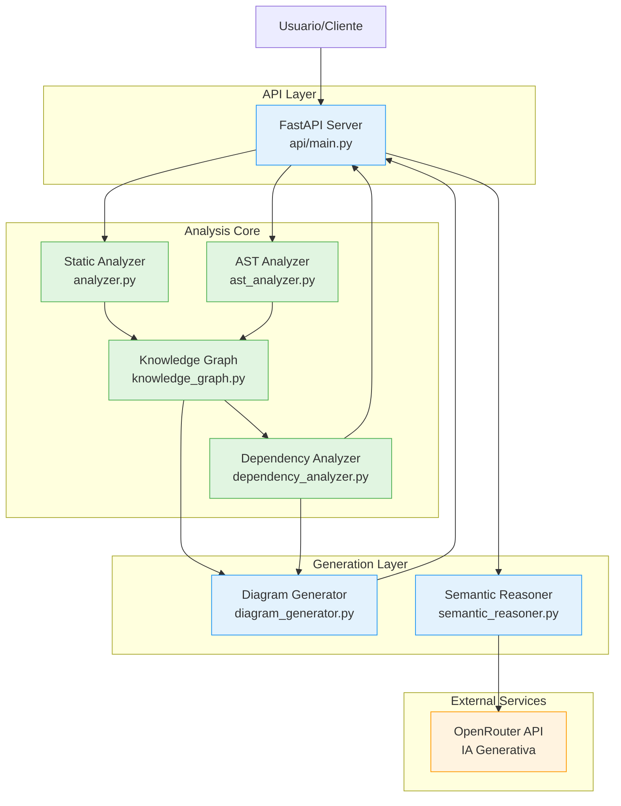
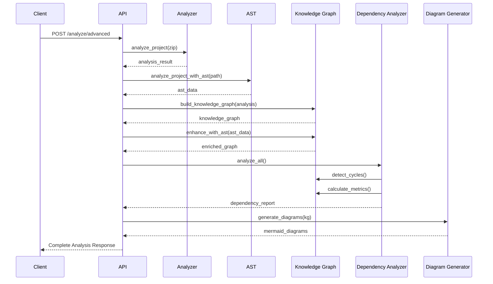
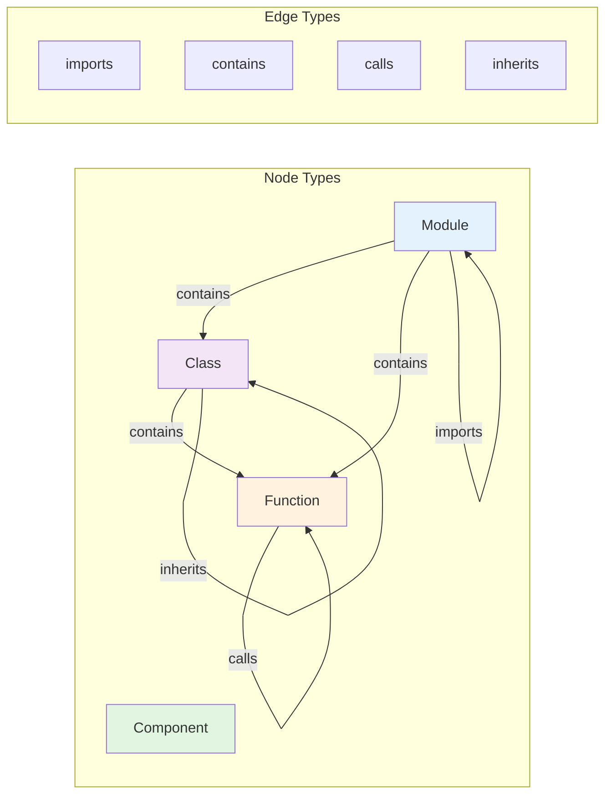
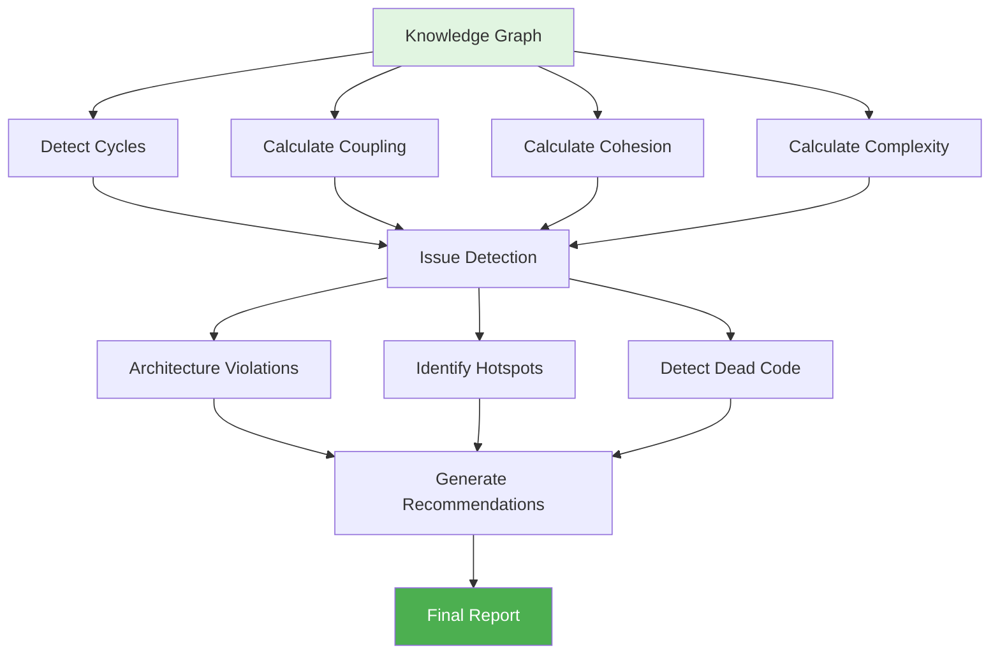

# Arquitectura del Agente de Análisis v2.0

## Vista General del Sistema



## Flujo de Análisis Completo



## Estructura del Grafo de Conocimiento



## Análisis de Dependencias - Pipeline



## Componentes Principales

### 1. Static Analyzer (analyzer.py)
```
Input: ZIP file / Directory
↓
- Extract project structure
- Detect containers (Docker, K8s, etc.)
- Identify components (Controllers, Services, etc.)
- Extract relations
↓
Output: analysis_result dict
```

### 2. AST Analyzer (ast_analyzer.py)
```
Input: Source files
↓
- Parse with tree-sitter
- Extract classes, methods, functions
- Identify function calls
- Detect inheritances
- Map imports
↓
Output: ast_data dict
```

### 3. Knowledge Graph (knowledge_graph.py)
```
Input: analysis_result + ast_data
↓
- Build directed graph (NetworkX)
- Add nodes (components, modules, classes, functions)
- Add edges (dependencies, calls, inheritances)
- Calculate metrics (PageRank, centrality, etc.)
↓
Output: KnowledgeGraph instance
```

### 4. Dependency Analyzer (dependency_analyzer.py)
```
Input: KnowledgeGraph
↓
- Detect dependency cycles
- Calculate coupling metrics (Ca, Ce, I)
- Measure cohesion
- Find architecture violations
- Identify hotspots & bottlenecks
- Generate recommendations
↓
Output: dependency_report dict
```

### 5. Diagram Generator (diagram_generator.py)
```
Input: KnowledgeGraph / analysis_result
↓
- Generate Mermaid diagrams:
  * Architecture overview
  * Dependency map
  * Component diagram
  * Class diagram (UML)
- Create dependency matrix
- Visualize metrics
↓
Output: Mermaid code / Markdown
```

## Tipos de Diagramas Generados

### 1. Architecture Diagram
Muestra componentes agrupados por tipo (controller, service, repository, etc.)

### 2. Dependency Diagram
Visualiza dependencias entre módulos con flechas dirigidas

### 3. Component Diagram
Agrupa componentes por módulo en subgrafos

### 4. Class Diagram
Diagrama UML con clases, métodos y herencias

### 5. Dependency Matrix
Tabla bidimensional de dependencias (Markdown)

### 6. Metrics Pie Chart
Distribución de tipos de componentes

## Métricas Calculadas

| Métrica | Descripción | Rango |
|---------|-------------|-------|
| **Afferent Coupling (Ca)** | Cuántos módulos dependen de este | 0-∞ |
| **Efferent Coupling (Ce)** | De cuántos módulos depende | 0-∞ |
| **Instability (I)** | Ce / (Ca + Ce) | 0-1 |
| **Cohesion Score** | Interconexión interna | 0-1 |
| **Cyclomatic Complexity** | E - N + 2P | 0-∞ |
| **PageRank** | Importancia del nodo | 0-1 |

## API Endpoints

```
GET /
├─ Información de la API

GET /health
├─ Health check

POST /analyze
├─ Análisis básico (compatible v1.x)
└─ Returns: analysis + diagramas C4

POST /analyze/advanced
├─ Análisis completo con AST + grafo
├─ Query params:
│   ├─ include_ast: bool
│   ├─ include_dependencies: bool
│   └─ diagram_type: str
└─ Returns: graph + metrics + diagrams + recommendations

POST /analyze/dependencies
├─ Solo análisis de dependencias
└─ Returns: cycles + coupling + violations

POST /analyze/metrics
├─ Solo métricas de calidad
└─ Returns: metrics + critical_nodes + bottlenecks
```

## Flujo de Datos

```
Project ZIP
    ↓
[Static Analysis]
    ↓
Components + Containers + Relations
    ↓
[AST Analysis] ← Source Files
    ↓
Classes + Functions + Calls + Imports
    ↓
[Knowledge Graph Builder]
    ↓
Directed Graph (Nodes + Edges)
    ↓
[Dependency Analyzer]
    ↓
Metrics + Issues + Recommendations
    ↓
[Diagram Generator]
    ↓
Mermaid Diagrams + Visualizations
    ↓
API Response (JSON)
```

## Extensibilidad

### Agregar nuevo lenguaje:
1. Instalar gramática tree-sitter
2. Agregar parser en `ast_analyzer.py`
3. Implementar métodos de extracción

### Agregar nueva métrica:
1. Implementar en `dependency_analyzer.py`
2. Agregar a `analyze_all()`
3. Incluir en reporte

### Agregar nuevo tipo de diagrama:
1. Crear función en `diagram_generator.py`
2. Agregar a `generate_mermaid_from_graph()`
3. Documentar en README

---

**Versión del Documento:** 2.0.0  
**Última Actualización:** 2024-11-13
