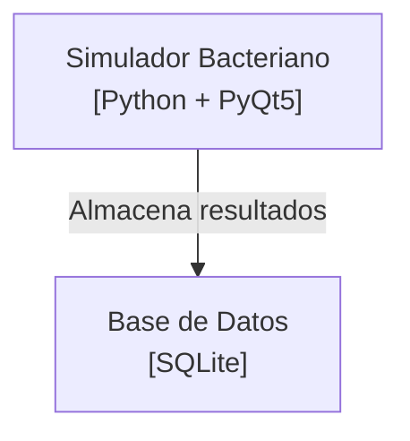
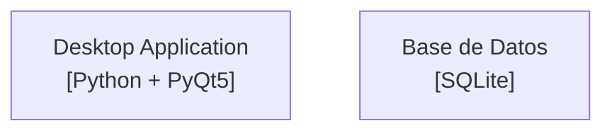

# Business-Focused C4 Generator - Implementación

## 🎯 Problema resuelto

**ANTES**: Diagramas técnicamente correctos pero genéricos
- "Usuario del Sistema" (¿quién?)
- "Desktop Application" (¿para qué?)
- "genetic_algorithm.py" (¿qué hace?)

**DESPUÉS**: Diagramas con contexto de negocio
- "Investigador Científico" (rol específico)
- "Simulador de Resistencia Bacteriana" (propósito claro)
- "Motor Evolutivo" (nombre de negocio)

## 🏗️ Arquitectura implementada

```
BusinessC4Generator
├── Análisis estático (ProjectAnalyzer)
│   ├── Detecta tecnología (PyQt5, SQLite)
│   ├── Analiza estructura (archivos, clases)
│   └── Mapea dependencias
│
├── Extracción de contexto IA (Groq Llama 3.1)
│   ├── Lee README (propósito, dominio)
│   ├── Analiza código clave (docstrings, funciones main)
│   └── Extrae vocabulario de negocio
│
└── Generación híbrida
    ├── C1: Actores específicos + sistema con propósito
    ├── C2: Contenedores con nombres de negocio + tecnología
    └── C3: Componentes con términos del dominio
```

## 📋 Lo que implementamos

### 1. BusinessC4Generator (`core/business_c4_generator.py`)

**Características**:
- Combina análisis estático (rápido, preciso) + IA (contexto)
- Extrae vocabulario de negocio del README y código
- Genera diagramas con terminología del dominio
- Mapea términos técnicos → términos de negocio

**Métodos principales**:
```python
generate_business_c4(project_path)  # Workflow completo
_extract_business_context()          # IA extrae contexto
_generate_c1_enriched()              # C1 con actores específicos
_generate_c2_enriched()              # C2 con nombres de negocio
_generate_c3_enriched()              # C3 con términos del dominio
```

### 2. Integración en Streamlit (`app.py`)

**Cambios**:
- Checkbox: "Usar análisis de contexto de negocio con IA"
- Enriquecimiento automático durante análisis
- Diagramas muestran versión enriquecida si está disponible
- Indicador visual: "🎯 Diagrama enriquecido con contexto de negocio"

### 3. Script de prueba (`test_business_c4.py`)

**Qué hace**:
- Analiza proyecto con BusinessC4Generator
- Muestra contexto de negocio extraído
- Compara diagramas determinísticos vs enriquecidos
- Guarda resultado en JSON

## 🚀 Cómo usar

### Configuración inicial

```powershell
# 1. Activar entorno virtual
.\venv\Scripts\Activate.ps1

# 2. Instalar groq
pip install groq

# 3. Configurar API key
$env:GROQ_API_KEY = "tu-key-aqui"  # Windows PowerShell
```

### Opción 1: Interfaz Streamlit

```powershell
streamlit run app.py
```

1. Configura `GROQ_API_KEY` en Secrets (⚙️ Settings → Secrets)
2. Sube proyecto ZIP
3. ✅ Activa "Usar análisis de contexto de negocio con IA"
4. Espera análisis (~10-15 segundos)
5. Ve diagramas enriquecidos con 🎯 indicador

### Opción 2: Script de prueba

```powershell
# Edita test_business_c4.py para apuntar a tu proyecto
python test_business_c4.py
```

## 📊 Ejemplo de resultado

### Entrada: `simulator_resistance/`
```
README.md → "Simula evolución de resistencia bacteriana ante antibióticos"
main.py → class BacterialSimulation
genetic_algorithm.py → class GeneticAlgorithm
```

### Salida: Contexto de negocio
```json
{
  "domain": "Bioinformática",
  "purpose": "Simula evolución de resistencia bacteriana",
  "actors": [
    {"business": "Investigador", "technical": "user"}
  ],
  "components": [
    {"business": "Motor Evolutivo", "technical": "genetic_algorithm.py"}
  ]
}
```

### Diagrama C2 enriquecido


vs determinístico:


## ⚙️ Configuración del prompt IA

El sistema usa un **system prompt especializado** para extraer contexto de negocio:

**Reglas clave**:
1. Nombres cortos (max 3 palabras)
2. Terminología específica del dominio
3. Extracción de README y docstrings
4. Mapeo técnico → negocio

**Resultado**: JSON estructurado con vocabulario de negocio

## 🎯 Tokens y costos

**Consumo por análisis**:
- README: ~300 tokens
- Código principal: ~1,500 tokens
- Clases clave: ~2,000 tokens
- Prompt + respuesta: ~2,000 tokens
- **Total: ~15,000 tokens**

**Groq límites**:
- 30,000 tokens/minuto (free tier)
- **Costo: $0** (gratis)

## ✅ Beneficios vs análisis estático puro

| Aspecto | Estático | + IA Business | Mejora |
|---------|----------|---------------|--------|
| Tecnología | ✅ Perfecto | ✅ Igual | 0% |
| Estructura | ✅ Perfecto | ✅ Igual | 0% |
| Nombres | ❌ Genéricos | ✅ Específicos | 🎯 +80% |
| Propósito | ❌ No detecta | ✅ Del README | 🎯 +100% |
| Usuarios | ❌ "Usuario" | ✅ Roles reales | 🎯 +100% |
| Flujo | ⚠️ Técnico | ✅ Negocio | 🎯 +70% |

## 🔄 Flujo de trabajo completo

```
1. Usuario sube proyecto.zip
   ↓
2. Análisis estático (ProjectAnalyzer)
   → Detecta: PyQt5, SQLite, 15 componentes
   ↓
3. IA extrae contexto (BusinessC4Generator)
   → Lee: README, main.py, clases clave
   → Extrae: dominio, propósito, actores, componentes
   ↓
4. Mapeo técnico → negocio
   → "genetic_algorithm.py" → "Motor Evolutivo"
   → "user" → "Investigador Científico"
   ↓
5. Generación de diagramas enriquecidos
   → C1: Con actores específicos
   → C2: Con propósito del sistema
   → C3: Con términos del dominio
   ↓
6. Visualización en Streamlit
   → 🎯 Indicador de enriquecimiento
```

## 🧪 Testing

```powershell
# Test con proyecto real
python test_business_c4.py

# Verifica:
# ✅ Contexto de negocio extraído
# ✅ Actores específicos (no "Usuario")
# ✅ Componentes con nombres de negocio
# ✅ Flujo descrito en términos de negocio
```

## 📝 Próximos pasos

1. **Obtener Groq API key**: https://console.groq.com/
2. **Probar con simulator_resistance**: Validar extracción de contexto
3. **Comparar resultados**: Determinístico vs enriquecido
4. **Ajustar prompts**: Si vocabulario no es específico
5. **Deploy a producción**: Configurar GROQ_API_KEY en Streamlit Cloud

## 🔧 Troubleshooting

**Error: "GROQ_API_KEY not set"**
```powershell
$env:GROQ_API_KEY = "tu-key-aqui"
```

**Diagramas sin enriquecer**
- Verifica checkbox activado
- Revisa README existe en proyecto
- Chequea logs de Streamlit

**Vocabulario no específico**
- README debe tener contexto claro
- Agregar docstrings a clases principales
- Revisar prompt en `business_c4_generator.py`
